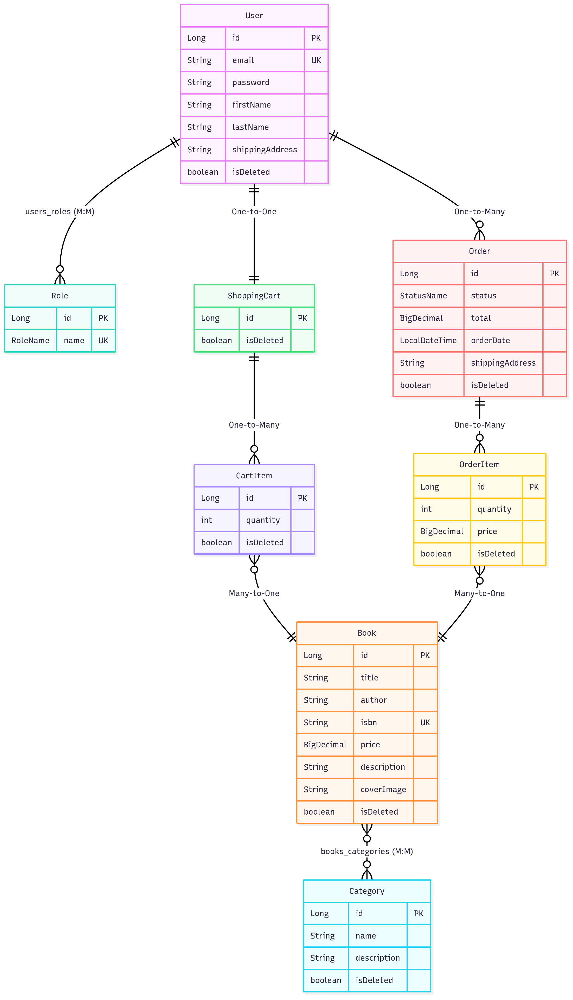

# 📚 Online Book Store API
A secure and extensible backend system for managing books, categories, users, and orders.  
This API handles registration, JWT authentication, partial book updates via PATCH, role-based access control, and integration testing.
It supports soft deletion using Hibernate annotations and uses Swagger for dynamic documentation.  
The project is containerized with Docker, version-controlled via Liquibase, and designed to scale in production-ready environments.

## 🚀 Motivation

This project showcases my backend engineering skills using Spring Boot and clean architecture.
It addresses common tasks in e-commerce systems like authentication, data filtering, validation, and role-based operations.

## Main project structure

### Online Book Store 

```
online-book-store/
├── src/
│   ├── main/
│   │   ├── java/
│   │   │   └── mate/academy/
│   │   │       ├── controller/                # REST controllers
│   │   │       ├── dto/                       # Data Transfer Objects  
│   │   │       ├── model/                     # JPA entity
│   │   │       ├── repository/                # Spring Data repositories
│   │   │       ├── service/                   # Business Logic
│   │   │       └── config/                    # Configuration
│   │   └── resources/
│   │       ├── db/changelog/                  # Liquibase migrations
│   │       └── application.properties         # Configuration Spring
│   └── test/                                  # Tests
├── docker-compose.yml                         # Docker Configuration  
├── .env.template                              # Template of environment variables
├── .env                                       # .env configuration (не в Git)
└── pom.xml                                    # Maven configuration
```

### Structure Description:

#### Main Java packages:
- **controller/** - REST controllers for handling HTTP requests
- **dto/** - Data Transfer Objects for API
- **model/** - JPA entities for database operations
- **repository/** - Spring Data JPA repositories
- **service/** - Business logic layer
- **config/** - Spring configuration classes

#### Resources:
- **db/changelog/** - Database migrations via Liquibase
- **application.properties** - Main Spring Boot configuration

#### Configuration files:
- **docker-compose.yml** - Docker containers setup
- **.env.template** - Environment variables template
- **.env** - Environment variables (not tracked by Git)
- **pom.xml** - Maven dependencies and configuration

## Model Diagram



This diagram shows the relationships between entities like `User`, `Book`, `Order`, `ShoppingCart`, etc.  
It supports understanding of the domain structure for contributors and reviewers.
This diagram shows the relationships between entities like `User`, `Book`, `Order`, `ShoppingCart`, etc.  
It supports understanding of the domain structure for contributors and reviewers.
Here's the diagram of all models with correct relationships:

### Entity Relationship

#### User Relations:
- **User ↔ Role**
  - **Many-to-Many** (through `users_roles` table)
  - One user can have multiple roles, one role can be assigned to multiple users

- **User ↔ ShoppingCart**
  - **One-to-One** (each user has one cart)
  - Each user has exactly one shopping cart

- **User ↔ Order**
  - **One-to-Many** (user can have many orders)
  - One user can place multiple orders over time

#### Shopping Cart Relations:
- **ShoppingCart ↔ CartItem**
  - **One-to-Many** (cart contains many items)
  - One shopping cart can contain multiple cart items

#### Book Relations:
- **Book ↔ Category**
  - **Many-to-Many** (through `books_categories` table)
  - One book can belong to multiple categories, one category can contain multiple books

- **CartItem ↔ Book**
  - **Many-to-One** (cart item references a book)
  - Multiple cart items can reference the same book

#### Order Relations:
- **Order ↔ OrderItem**
  - **One-to-Many** (order contains many items)
  - One order can contain multiple order items

- **OrderItem ↔ Book**
  - **Many-to-One** (order item references a book)
  - Multiple order items can reference the same book

#### Summary of Junction Tables:
- `users_roles` - Links users with their roles
- `books_categories` - Links books with their categories

### **Key Features:**

All entities have soft delete through isDeleted field
ShoppingCart uses @MapsId for relationship with User
StatusName - enum for order statuses
RoleName - enum for user roles

## 🛠 Tech Stack

 Technology        | Version               |
|------------------|-----------------------|
| Java             | 17                    |
| Spring Boot      | 3.5.0                 |
| Spring Security  | 3.5.0                 |
| Spring Data JPA  | 3.5.0                 |
| Liquibase        | 4.32                  |
| Docker           | 28.2.2                |
| Swagger / OpenAPI| 2.8.8                 |
| MapStruct        | 1.5.5.Final           |
| JUnit            | 5.x(Spring Boot Test) |
| Mockito          | 5.x(Spring Boot Test) |
| MockMvc          | built-in              |
| Testcontainers   | 1.21.3                |


## 📦 Functionality

| Feature           | Description                                                                 |
|-------------------|------------------------------------------------------------------------------|
| Book Management   | List, search, create, partial update (PATCH), soft-delete                    |
| Categories        | Assign categories to books, filter by category                               |
| Authentication    | Register/login with JWT, user/admin roles                                   |
| Orders (optional) | Add books to cart, submit orders, view user history                         |
| DTO Validation    | Conditional constraints for PATCH vs POST                                   |
| Testing           | Unit + integration tests using SQL fixtures and containerized DBs            |


## 🗂 API Endpoints

####   Authentication

✅ User Registration (POST: /api/auth/register)

✅ User Login (з JWT token) (POST: /api/auth/login)

#### Books Management

✅ Get All Books (with pagination) (GET: /api/books)

✅ Get Book by ID (GET: /api/books/{id})

✅ Create Book (Admin) (POST: /api/books/)

✅ Update Book (Admin) (PATCH: /api/books/{id})

✅ Delete Book (Admin) (DELETE: /api/books/{id})

✅ Search Books (with filters) (GET: /api/books/search)

#### Categories Management

✅ Get All Categories (with pagination) (GET: /api/categories)

✅ Get Book by ID (GET: /api/categories/{id})

✅ Create Category (Admin) (POST: /api/categories/)

✅ Update Category (Admin) (PATCH: /api/categories/{id})

✅ Delete Category (Admin) (DELETE: /api/categories/{id})

✅ Get Books by Category (GET: /api/categories/{id}/books)

#### Shopping Cart

✅ Get Cart (GET: /api/cart)

✅ Add Book to Cart (POST: /api/cart)

✅ Update Item Quantity (PUT: /api/cart/cart-items/{cartItemId})

✅ Remove Item from Cart (DELETE: /api/cart/cart-items/{cartItemId})

#### Orders Management

✅ Create Order (POST: /api/orders)

✅ Get User Orders (GET: /api/orders)

✅ Update Order Status (Admin) (PATCH: /api/orders/{id})

✅ Get Order Items (GET: /api/orders/{orderId}/items)

✅ Get Order Items (GET: /api/orders/{orderId}/items)

✅ Get one item by itemId from the order by orderId (GET: /api/orders/{orderId}/items/{itemId})

✅ Get Orders by Status (Admin) (GET: /api/orders/status/{status})

### Access Swagger UI
For API documentation and testing, navigate to:
```bash
http://localhost:8081/api/swagger-ui/index.html#
```
Since the project uses Spring Security, you'll need to log in with the following credentials:
**Username: dmytro@example.com**(USER, ADMIN roles)
**Password: 12345678910**

## 📥 How to Run Locally

#### **_Step 1: Clone the Repository_**:

https://github.com/kostya-savchenko/online-book-store

```
cd online-book-store
```

#### **_Step 2: Set Up Environment Variables_**:

Copy the environment template
```
cp .env.template .env
```

#### **_Step 3: Configure Your .env File_**:

Open the .env file and fill in the following variables:

**Database Configuration:**
```
MYSQLDB_USER=root

MYSQLDB_ROOT_PASSWORD=your_secure_password

MYSQLDB_DATABASE=book_store

MYSQLDB_LOCAL_PORT=3307

MYSQLDB_DOCKER_PORT=3306
```

**Spring Boot Configuration**
```
SPRING_LOCAL_PORT=8081

SPRING_DOCKER_PORT=8080

DEBUG_PORT=5005
```
**⚠️ Important:**
Change MYSQLDB_ROOT_PASSWORD to your own secure password
Make sure ports don't conflict with other services

#### **_Step 4: Maven repackage_**:
Repackage the project with command:
```
mvn clean package
```

#### **_Step 5: Run with Docker_**:

tart all services
```
docker-compose up --build
```

#### **_Step 6: Verify the Setup_**:

After successful startup, services will be available at:

API: http://localhost:8081

Swagger UI: http://localhost:8081/api/swagger-ui.html

MySQL: localhost:3307
